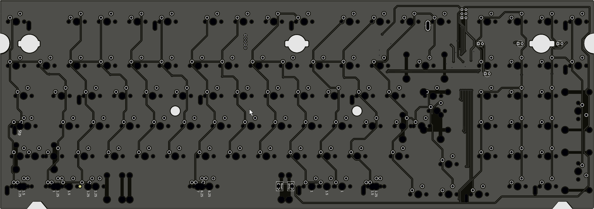
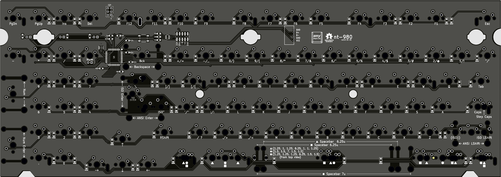

nt-980 full solder version files

Files: 

- : PCB KiCad design files
- : PCB JLC Production files (Gerber, BOM, and positioning file)
- Plate Files - FR-4 if needed
  - JLC Production Files (Gerber) don't need BOM or Positioning file
  - KiCad design files

Front

Back

